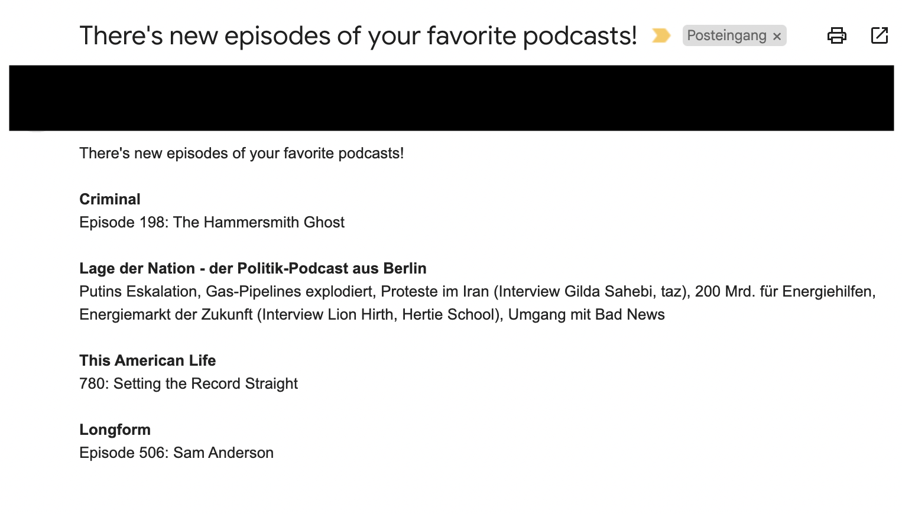

# Favorite Podcasts

A small tool to periodically check my favorite podcasts for new episodes and then send myself an email with the happy news.

## Email
I'm using [sendgrid](https://sendgrid.com/) to send an automated email if new podcasts are detected. You can create a free account with a limit of 100 emails per day.

Afterwards update `FROM_MAIL` and `TO_MAIL` in `podcasts-crawler.py` and add the `SENDGRID_API_KEY` to your environment keys.

## Podcasts
The podcasts are organized in `podcasts.json`. You can add or delete podcasts from the list using [click arguments](https://click.palletsprojects.com/en/8.1.x/), use `--help` to check out the options.

Unfortunately we currently need the ID to query for a podcast. To find the podcast ID you can search for the podcast on https://podcasts.apple.com/, click on your podcast and find the ID in the last digits of its URL, e.g. `xxx/id201671138`.

---

Now you can get an hourly, daily or weekly update for the latest episodes of your favorite podcasts!

